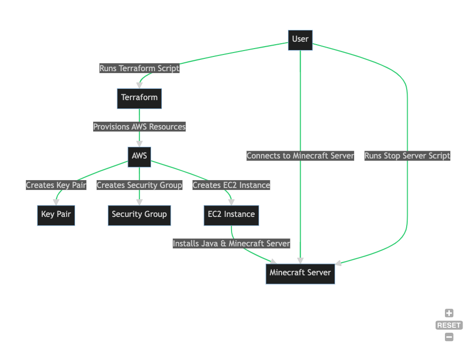

# Minecraft Server on AWS with Terraform - Tutorial

## Background
This tutorial provides step-by-step instructions to deploy a Minecraft server on an Amazon Web Services (AWS) instance using Terraform, an Infrastructure as Code (IaC) tool. With Terraform, we can automate the creation, management, and deletion of resources.



The diagram above illustrates the process we will undertake in this tutorial.

## Requirements

### Tools and Dependencies
You should have the following tools installed on your system:

- [Terraform](https://learn.hashicorp.com/tutorials/terraform/install-cli) (v1.2.0 or above)
- [AWS CLI](https://aws.amazon.com/cli/)
- [Homebrew](https://brew.sh/) (for macOS users)
- An SSH client (e.g., [PuTTY](https://www.putty.org/) for Windows or the built-in SSH command for Unix-based systems)

### AWS Account Setup
Ensure you have an active [AWS account](https://aws.amazon.com/premiumsupport/knowledge-center/create-and-activate-aws-account/), and configure your AWS CLI using `aws configure` to interact with your account.

### SSH Key Pair
Generate an SSH key pair on your local machine and save it in the directory `/Users/your-username/OSU/OsuSpring2023/CS312/cs312-final-project/`. Replace `your-username` with your actual username. Refer to [this guide](https://docs.aws.amazon.com/AWSEC2/latest/UserGuide/ec2-key-pairs.html) for instructions.

## Tutorial

### Install Terraform
If you are using macOS, run the `install_terraform.sh` script to install Terraform:

```bash
$ chmod +x install_terraform.sh
$ ./install_terraform.sh
```

## Clone the Repository
Clone the repository containing the Terraform scripts.

```bash
$ git clone <repository_url>
```

## Initialize Terraform
In your terminal, navigate to the directory containing the setup-server.tf file and initialize Terraform.

```bash
$ cd /path/to/terraform/files
$ terraform init
```

## Apply the Terraform Configuration
Apply the Terraform configuration. This command will create the AWS resources defined in the setup-server.tf file.

```bash
$ terraform apply
```

You'll be prompted to confirm the actions. Type yes and hit enter to proceed. Terraform will then create the resources.

## Connect to the Minecraft Server
Once the resources are successfully created, the public IP of the Minecraft server will be displayed in the output. Use this IP to connect to your server using your preferred Minecraft client.

In the multiplayer section of the game, add a new server and use the IP address provided by the Terraform output.

## Stop the Minecraft Server
When you want to stop the server, run the stop-server.sh script.

```bash
$ chmod +x stop-server.sh
$ ./stop-server.sh
```

### Resources/Sources
- [Terraform](https://www.terraform.io/)
- [AWS CLI](https://aws.amazon.com/cli/)
- [AWS](https://aws.amazon.com/)
- [Minecraft](https://www.minecraft.net/)
- [ChatGPT OpenAI](https://chat.openai.com/)
- [Darrel Davis Terraform-AWS-Minecraft](https://github.com/darrelldavis/terraform-aws-minecraft)


